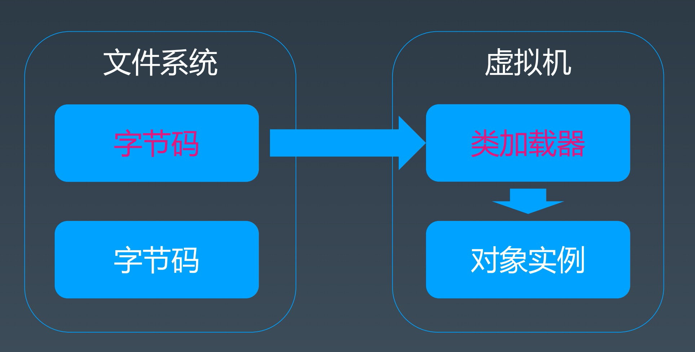
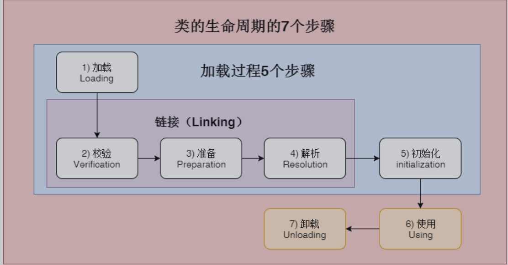
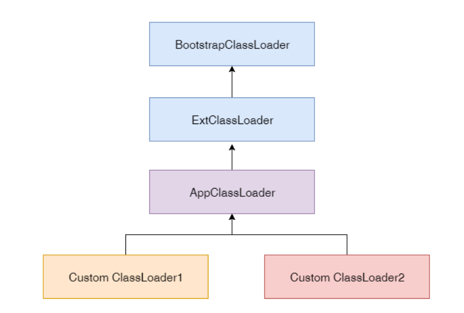
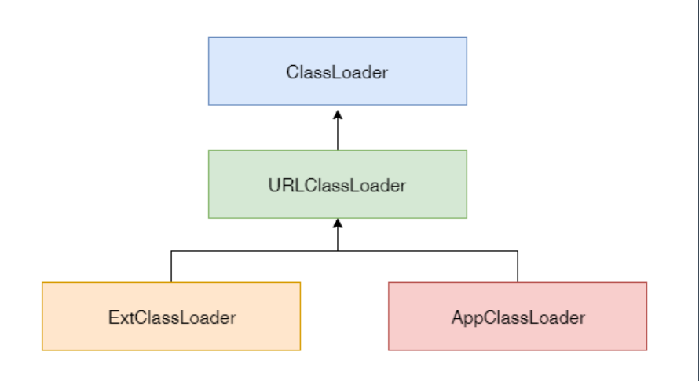

#极客大学 Java 进阶训练营 JVM核心技术 week1 学习笔记

# 一 JVM基础知识

###编程语言的特点 

- 面向过程、面向对象、面向函数
- 静态类型、动态类型
- 编译执行、解释执行
- 有虚拟机、无虚拟机
- 有GC、无GC

> Java是一种面向对象的，静态类型、编译运行，有JVM、GC和运行时的、跨平台的高级语言。


###编程语言跨平台

1.源代码跨平台 

2.二进制跨平台


###Java、C++、Rust的区别

> ==C/C++==完全相信而且惯着程序员，让大家自行管理内存，所以可以编写很自由的代码，
>
> 但一个不小心就会造成内存泄漏等问题导致程序崩溃。
>
> 
>
> ==Java/Golang==完全不相信程序员，但也惯着程序员。所有的内存生命周期都由JVM/运行
>
> 时统一管理。 在绝大部分场景下，你可以非常自由的写代码，而且不用关心内存到底是
>
> 什么情况。 内存使用有问题的时候，我们可以通过JVM来信息相关的分析诊断和调整。
>
> 这也是本课程的目标。
>
> 
>
> ==Rust==语言选择既不相信程序员，也不惯着程序员。 让你在写代码的时候，必须清楚明白
>
> 的用Rust的规则管理好你的变量，好让机器能明白高效地分析和管理内存。 但是这样会
>
> 导致代码不利于人的理解，写代码很不自由，学习成本也很高。

### 字节码、类加载器、虚拟机



# 二 Java字节码技术

## 什么是字节码？

Java bytecode 由单字节(byte)的指令组成，理论上最多支持 256 个操作码(opcode)。实际上Java只使用了200左右的操作码， 还有一些操作码则保留给调试操作。

## 字节码分类

==根据指令的性质，主要分为四个大类：==

1. 栈操作指令，包括与局部变量交互的指令

2. 程序流程控制指令

3. 对象操作指令，包括方法调用指令

4. 算术运算以及类型转换指令

## 如何编译和反编译？

```java
package demo.jvm0104;

/**
 * Copyright @ 2019 Citycloud Co. Ltd.
 * All right reserved.
 *
 * @author edd1225
 * @Description: java类作用描述
 * @create 2020/10/20 22:23
 **/
public class HelloByteCode {
    public static void main(String[] args) {
        HelloByteCode  obj=new HelloByteCode();
    }
}

```
1. 使用 javac -g Hello.java编译java源代码

2. 使用 javap -c -verbose Hello 反编译class文件成助记符文件（汇编语言形式）

   ###简单例子

```
  1 Compiled from "HelloByteCode.java" 
  2 public class demo.jvm0104.HelloByteCode { 
  3   public demo.jvm0104.HelloByteCode(); 
  4     Code: 
  5        0: aload_0 
  6        1: invokespecial #1                  // Method java/lang/Object."<init>":()V 
  7        4: return 
  8  
  9   public static void main(java.lang.String[]); 
 10     Code: 
 11        0: new           #2                  // class demo/jvm0104/HelloByteCode 
 12        3: dup 
 13        4: invokespecial #3                  // Method "<init>":()V 
 14        7: astore_1 
 15        8: return 
 16 }

```


###复杂点的例子
```
Classfile /Users/qianjiang/tmp/JAVA-000/Week_01/Java_training_code/src/main/java/demo/jvm0104/HelloByteCode.class
  Last modified 2020-10-21; size 301 bytes
  MD5 checksum dbfeb2d66f629f224cfdc18d5e24f4ad
  Compiled from "HelloByteCode.java"
public class demo.jvm0104.HelloByteCode
  minor version: 0
  major version: 52
  flags: ACC_PUBLIC, ACC_SUPER
Constant pool:
   #1 = Methodref          #4.#13         // java/lang/Object."<init>":()V
   #2 = Class              #14            // demo/jvm0104/HelloByteCode
   #3 = Methodref          #2.#13         // demo/jvm0104/HelloByteCode."<init>":()V
   #4 = Class              #15            // java/lang/Object
   #5 = Utf8               <init>
   #6 = Utf8               ()V
   #7 = Utf8               Code
   #8 = Utf8               LineNumberTable
   #9 = Utf8               main
  #10 = Utf8               ([Ljava/lang/String;)V
  #11 = Utf8               SourceFile
  #12 = Utf8               HelloByteCode.java
  #13 = NameAndType        #5:#6          // "<init>":()V
  #14 = Utf8               demo/jvm0104/HelloByteCode
  #15 = Utf8               java/lang/Object
{
  public demo.jvm0104.HelloByteCode();
    descriptor: ()V
    flags: ACC_PUBLIC
    Code:
      stack=1, locals=1, args_size=1
         0: aload_0
         1: invokespecial #1                  // Method java/lang/Object."<init>":()V
         4: return
      LineNumberTable:
        line 12: 0

  public static void main(java.lang.String[]);
    descriptor: ([Ljava/lang/String;)V
    flags: ACC_PUBLIC, ACC_STATIC
    Code:
      stack=2, locals=2, args_size=1
         0: new           #2                  // class demo/jvm0104/HelloByteCode
         3: dup
         4: invokespecial #3                  // Method "<init>":()V
         7: astore_1
         8: return
      LineNumberTable:
        line 14: 0
        line 15: 8
}
SourceFile: "HelloByteCode.java"
```

## 字节码运行时结构

每个线程都会创建自己的线程栈，用于存储栈帧，每一次方法调用，JVM都会自动创建一个栈帧。


栈帧组成：

- Class引用，指向常量池 在堆内存中或元数据空间
- 局部变量数组
- 操作数栈


###方法调用的指令：

> invokestatic，顾名思义，这个指令用于调用某个类的静态方法，这也是方法调用指令中最快的一个。
>
> invokespecial, 我们已经学过了, invokespecial 指令用来调用构造函数，但也可以用于调用同一个类中的 private 方法, 以及可见的超类方法。
>
> invokevirtual，如果是具体类型的目标对象，invokevirtual用于调用公共，受保护和打包私有方法。
>
> invokeinterface，当要调用的方法属于某个接口时，将使用 invokeinterface 指令。
>
> invokedynamic,，JDK7新增加的指令是实现“动态类型语言”（Dynamically Typed  Language）支持而进行的改进之一，同时也是JDK 8以后支持的lambda表达式的实现基础。

# 三  JVM类加载器

## 类的声明周期



1. 加载（Loading）：找class文件

2. 验证（Verification）：验证格式、依赖

3. 准备（Preparation）：静态字段、方法表

4. 解析（Resolution）：符号解析为引用

5. 初始化（Initialization）：构造器、静态变量赋值、静态代码块

6. 使用（Using）

7. 卸载（Unloading）


## 类的加载初始化时机

1. 当虚拟机启动时，初始化用户指定的主类，就是启动执行的 main方法所在的类；

2. 当遇到用以新建目标类实例的 new 指令时，初始化 new 指令的目标类，就是new一个类的时候要初始化；

3. 当遇到调用静态方法的指令时，初始化该静态方法所在的类；

4. 当遇到访问静态字段的指令时，初始化该静态字段所在的类；

5. 子类的初始化会触发父类的初始化；

6. 如果一个接口定义了 default 方法，那么直接实现或者间接实现该接口的类的初始化，会触发该接口的初始化；

7. 使用反射 API 对某个类进行反射调用时，初始化这个类，其实跟前面一样，反射调用要么是已经有实例了，要么是静态方法，都需要初始化；

8. 当初次调用 MethodHandle 实例时，初始化该 MethodHandle 指向的方法所在的类。

## 类不初始化（可能会加载）

1. 通过子类引用父类的静态字段，只会触发父类的初始化，而不会触发子类的初始化。

2. 定义对象数组，不会触发该类的初始化。

3. 常量在编译期间会存入调用类的常量池中，本质上并没有直接引用定义常量的类，不会触发定义常量所在的类。

4. 通过类名获取Class对象，不会触发类的初始化，Hello.class不会让Hello类初始化。

5. 通过Class.forName加载指定类时，如果指定参数initialize为false时，也不会触发类初始化，其实这个参数是告诉虚拟机，是否要对类进行初始化。Class.forName(“jvm.Hello”)默认会加载Hello类。

6. 通过ClassLoader默认的loadClass方法，也不会触发初始化动作（加载了，但是不初始化）。

## 加载器类型



###三类加载器：

1. 启动类加载器（BootstrapClassLoader）

2. 扩展类加载器（ExtClassLoader）

3. 应用类加载器（AppClassLoader）

## 加载器特点



1. 双亲委托
2. 加载依赖
3. 缓存

###添加引用类的几种方式

1、放到jdk的lib/ext下，或者-Djava.ext.dirs

2、 java –cp/classpath或者class文件放到当前路径

3、自定义Classloader加载

4、拿到当前执行类的Classloader，反射调用AddUrl方法添加jar或路径(JDK9无效)。

## 自定义加载器 Classloader

###1.加载的一个Hello类：1 package jvm; 

```java
 

public class Hello { 
		static { 
 			System.out.println("Hello Class Initialized!"); 
		} 
 } 
```

###2. HelloClassLoader
```
###package jvm; 

import java.util.Base64; 

public class HelloClassLoader extends ClassLoader { 

	public static void main(String[] args) { 

	try { 

      new HelloClassLoader().findClass("jvm.Hello").newInstance(); // 加载并初始化Hello类 

	 } catch (ClassNotFoundException e) { 

 		e.printStackTrace(); 

 	} catch (IllegalAccessException e) { 

 		e.printStackTrace(); 

	} catch (InstantiationException e) { 

 		e.printStackTrace(); 
 	} 
} 

@Override 

 protected Class<?> findClass(String name) throws ClassNotFoundException{
String helloBase64="yv66vgAAADQAHwoABgARCQASABMIABQKABUAFgcAFwcAGAEABjxpbml0PgEAAygpVgEABENvZGUBAA9MaW5lTn" +
"VtYmVyVGFibGUBABJMb2NhbFZhcmlhYmxlVGFibGUBAAR0aGlzAQALTGp2bS9IZWxsbzsBAAg8Y2xpbml0PgEAClNvdXJjZUZpbGUBAAp" +
"IZWxsby5qYXZhDAAHAAgHABkMABoAGwEAGEhlbGxvIENsYXNzIEluaXRpYWxpemVkIQcAHAwAHQAeAQAJanZtL0hlbGxvAQAQamF2YS9s" +
"YW5nL09iamVjdAEAEGphdmEvbGFuZy9TeXN0ZW0BAANvdXQBABVMamF2YS9pby9QcmludFN0cmVhbTsBABNqYXZhL2lvL1ByaW50U3RyZ" +
"WFtAQAHcHJpbnRsbgEAFShMamF2YS9sYW5nL1N0cmluZzspVgAhAAUABgAAAAAAAgABAAcACAABAAkAAAAvAAEAAQAAAAUqtwABsQAAAA" +
"IACgABAAkAAAAvAAEAAQAAAAUqtwABsQAAAAIACgAAAAYAAQAAAAMACwAAAAwAAQAAAAUADAANAAAACAAOAAgAAQAJAAAAJQ"; 

		byte[] bytes = decode(helloBase64); 
		return defineClass(name,bytes,0,bytes.length); 
	} 
		public byte[] decode(String base64){ 
		return Base64.getDecoder().decode(base64); 
	} 
}

```

###直接执行这个类： 
```shell
 java jvm.HelloClassLoader 

 Hello Class Initialized! 
```

> 可以看到达到了我们的目的，成功执行了Hello类的代码，但是完全不需要有Hello这个 类的class文件。此外，需要说明的是两个没有关系的自定义类加载器之间加载的类是不共享的（只共享父类加载器，兄弟之间不共享），这样就可以实现不同的类型沙箱的隔离性，我们可以用多个类加载器，各自加载同一个类的不同版本，大家可以相互 之间不影响彼此，从而在这个基础上可以实现类的动态加载卸载，热插拔的插件机制 等，具体信息大家可以参考OSGi等模块化技术。 

### 一些实用技巧

**1）如何排查找不到Jar包的问题？**

有时候我们会面临明明已经把某个jar加入到了环境里，可以运行的时候还是找不到。 那么我们有没有一种方法，可以直接看到各个类加载器加载了哪些jar，以及把哪些路径加到了classpath里？答案是肯定的，代码如下：

```java
package jvm; 

import java.lang.reflect.Field; 
import java.net.URL; 
import java.net.URLClassLoader; 
import java.util.ArrayList; 

public class JvmClassLoaderPrintPath { 


public static void main(String[] args) { 

 // 启动类加载器 
	URL[] urls = sun.misc.Launcher.getBootstrapClassPath().getURLs(); 
	System.out.println("启动类加载器"); 
	
  for(URL url : urls) { 
		System.out.println(" ==> " +url.toExternalForm()); 
  } 

// 扩展类加载器 
	printClassLoader("扩展类加载器", JvmClassLoaderPrintPath.class.getClassLoader 

// 应用类加载器 
 	printClassLoader("应用类加载器", JvmClassLoaderPrintPath.class.getClassLoader 
} 
                  
 public static void printClassLoader(String name, ClassLoader CL){ 
    if(CL != null) { 
    	System.out.println(name + " ClassLoader ‐> " + CL.toString()); 
    	printURLForClassLoader(CL); 
     }else{ 
		System.out.println(name + " ClassLoader ‐> null"); 
	 	} 
 } 

   public static void printURLForClassLoader(ClassLoader CL){ 
     Object ucp = insightField(CL,"ucp"); 
     Object path = insightField(ucp,"path");
     ArrayList ps = (ArrayList) path;41 for (Object p : ps){ 
      System.out.println(" ==> " + p.toString()); 
		} 
 } 


	private static Object insightField(Object obj, String fName) { 
     try { 
     Field f = null; 
     if(obj instanceof URLClassLoader){ 
   			 f = URLClassLoader.class.getDeclaredField(fName); 
    	}else{ 
    		f = obj.getClass().getDeclaredField(fName); 
     } 
     		f.setAccessible(true); 
     return f.get(obj); 
     } catch (Exception e) { 
     e.printStackTrace(); 
     return null; 
     } 
	} 
} 
``````
代码执行结果如下： 
```
启动类加载器 
==> file:/D:/Program%20Files/Java/jdk1.8.0_231/jre/lib/resources.jar 
==> file:/D:/Program%20Files/Java/jdk1.8.0_231/jre/lib/rt.jar 
==> file:/D:/Program%20Files/Java/jdk1.8.0_231/jre/lib/sunrsasign.jar 
==> file:/D:/Program%20Files/Java/jdk1.8.0_231/jre/lib/jsse.jar 
==> file:/D:/Program%20Files/Java/jdk1.8.0_231/jre/lib/jce.jar 
==> file:/D:/Program%20Files/Java/jdk1.8.0_231/jre/lib/charsets.jar 
==> file:/D:/Program%20Files/Java/jdk1.8.0_231/jre/lib/jfr.jar 
==> file:/D:/Program%20Files/Java/jdk1.8.0_231/jre/classes 

扩展类加载器 ClassLoader ‐> sun.misc.Launcher$ExtClassLoader@15db9742 
==> file:/D:/Program%20Files/Java/jdk1.8.0_231/jre/lib/ext/access‐bridge 
==> file:/D:/Program%20Files/Java/jdk1.8.0_231/jre/lib/ext/cldrdata.jar 
==> file:/D:/Program%20Files/Java/jdk1.8.0_231/jre/lib/ext/dnsns.jar 
==> file:/D:/Program%20Files/Java/jdk1.8.0_231/jre/lib/ext/jaccess.jar16 
==> file:/D:/Program%20Files/Java/jdk1.8.0_231/jre/lib/ext/jfxrt.jar 
==> file:/D:/Program%20Files/Java/jdk1.8.0_231/jre/lib/ext/localedata.jar 
==> file:/D:/Program%20Files/Java/jdk1.8.0_231/jre/lib/ext/nashorn.jar 
==> file:/D:/Program%20Files/Java/jdk1.8.0_231/jre/lib/ext/sunec.jar 
==> file:/D:/Program%20Files/Java/jdk1.8.0_231/jre/lib/ext/sunjce_provider 
==> file:/D:/Program%20Files/Java/jdk1.8.0_231/jre/lib/ext/sunmscapi.jar 
==> file:/D:/Program%20Files/Java/jdk1.8.0_231/jre/lib/ext/sunpkcs11.jar 
==> file:/D:/Program%20Files/Java/jdk1.8.0_231/jre/lib/ext/zipfs.jar 

应用类加载器 ClassLoader ‐> sun.misc.Launcher$AppClassLoader@73d16e93 
==> file:/D:/git/studyjava/build/classes/java/main/ 
==> file:/D:/git/studyjava/build/resources/main 
```

从打印结果，我们可以看到三种类加载器各自默认加载了哪些jar包和包含了哪些classpath的路径。 

**2）如何排查类的方法不一致的问题**

假如我们确定一个jar或者class已经在classpath里了，但是却总是提示 java.lang.NoSuchMethodError ，这是怎么回事呢？很可能是加载了错误的或 者重复加载了不同版本的jar包。这时候，用前面的方法就可以先排查一下，加载了具 体什么jar，然后是不是不同路径下有重复的class文件，但是版本不一样。 

**3）怎么看到加载了哪些类，以及加载顺序**

还是针对上一个问题，假如有两个地方有Hello.class，一个是新版本，一个是旧的， 怎么才能直观地看到他们的加载顺序呢？也没有问题，我们可以直接打印加载的类清 单和加载顺序。 

只需要在类的启动命令行参数加上 ‐XX:+TraceClassLoading 或者 ‐verbose 即可，注意需要加载java命令之后，要执行的类名之前，不然不起作用。例如： 

```

1 $ java ‐XX:+TraceClassLoading jvm.HelloClassLoader 

2 [Opened D:\Program Files\Java\jre1.8.0_231\lib\rt.jar] 

3 [Loaded java.lang.Object from D:\Program Files\Java\jre1.8.0_231\lib\rt.jar 

4 [Loaded java.io.Serializable from D:\Program Files\Java\jre1.8.0_231\lib\rt 

5 [Loaded java.lang.Comparable from D:\Program Files\Java\jre1.8.0_231\lib\rt 

6 [Loaded java.lang.CharSequence from D:\Program Files\Java\jre1.8.0_231\lib 

7 [Loaded java.lang.String from D:\Program Files\Java\jre1.8.0_231\lib\rt.jar 

8 [Loaded java.lang.reflect.AnnotatedElement from D:\Program Files\Java\jre19 [Loaded java.lang.reflect.GenericDeclaration from D:\Program Files\Java\jre1 

10 [Loaded java.lang.reflect.Type from D:\Program Files\Java\jre1.8.0_231\lib 

11 [Loaded java.lang.Class from D:\Program Files\Java\jre1.8.0_231\lib\rt.jar 

12 [Loaded java.lang.Cloneable from D:\Program Files\Java\jre1.8.0_231\lib\rt 

13 [Loaded java.lang.ClassLoader from D:\Program Files\Java\jre1.8.0_231\lib\ 

14 [Loaded java.lang.System from D:\Program Files\Java\jre1.8.0_231\lib\rt.jar 

15 // ....... 此处省略了100多条类加载信息 

16 [Loaded jvm.Hello from __JVM_DefineClass__] 

17 [Loaded java.util.concurrent.ConcurrentHashMap$ForwardingNode from D:\Program 

18 Hello Class Initialized! 

19 [Loaded java.lang.Shutdown from D:\Program Files\Java\jre1.8.0_231\lib\rt. 

20 [Loaded java.lang.Shutdown$Lock from D:\Program Files\Java\jre1.8.0_231\lib 
```

上面的信息，可以很清楚的看到类的加载先后顺序，以及是从哪个jar里加载的，这样排查类加载的问题非常方便。 

**4）怎么调整或修改ext和本地加载路径？** 

从前面的例子我们可以看到，假如什么都不设置，直接执行java命令，默认也会加载非常多的jar包，怎么可以自定义加载哪些jar包呢？比如我的代码很简单，只加载rt.jar 行不行？答案是肯定的。 

```
1 $ java ‐Dsun.boot.class.path="D:\Program Files\Java\jre1.8.0_231\lib\rt.jar" 
启动类加载器 
==> file:/D:/Program%20Files/Java/jdk1.8.0_231/jre/lib/rt.jar 
扩展类加载器 ClassLoader ‐> sun.misc.Launcher$ExtClassLoader@15db9742 
应用类加载器 ClassLoader ‐> sun.misc.Launcher$AppClassLoader@73d16e93 
==> file:/D:/git/studyjava/build/classes/java/main/ 
==> file:/D:/git/studyjava/build/resources/main 
```
我们看到启动类加载器只加载了rt.jar，而扩展类加载器什么都没加载，这就达到了我们的目的。 

其中命令行参数 ‐Dsun.boot.class.path 表示我们要指定启动类加载器加载什么， 最基础的东西都在rt.jar这个包了里，所以一般配置它就够了。需要注意的是因为在 windows系统默认JDK安装路径有个空格，所以需要把整个路径用双引号括起来，如果路径没有空格，或是Linux/Mac系统，就不需要双引号了。 

参数 ‐Djava.ext.dirs 表示扩展类加载器要加载什么，一般情况下不需要的话可以直接配置为空即可。 

**5）怎么运行期加载额外的jar包或者class呢？** 

有时候我们在程序已经运行了以后，还是想要再额外的去加载一些jar或类，需要怎么做呢？ 

简单说就是不使用命令行参数的情况下，怎么用代码来运行时改变加载类的路径和方式。假如说，在 d:/app/jvm 路径下，有我们刚才使用过的Hello.class文件，怎么在 代码里能加载这个Hello类呢？ 

两个办法，一个是前面提到的自定义ClassLoader的方式，还有一个就是直接在当前的应用类加载器里，使用 

URLClassLoader类的方法addURL，不过这个方法是protected的，需要反射处理一下，然后又因为程序在启动时并没有显示加载Hello类，所以在添加完了classpath以后，没法直接显式初始化，需要使用Class.forName的方式来拿到已经加载的Hello类 （Class.forName("jvm.Hello")默认会初始化并执行静态代码块）。代码如下： 
```java
package jvm; 
import java.lang.reflect.InvocationTargetException; 
import java.lang.reflect.Method; 
import java.net.MalformedURLException; 
import java.net.URL; 
import java.net.URLClassLoader; 
public class JvmAppClassLoaderAddURL { 
	public static void main(String[] args) { 

     String appPath = "file:/d:/app/"; 
		 URLClassLoader urlClassLoader = (URLClassLoader) JvmAppClassLoaderAddURL ;
		try { 
			Method addURL = URLClassLoader.class.getDeclaredMethod("addURL");
      addURL.setAccessible(true); 
      
      URL url = new URL(appPath); 
      addURL.invoke(urlClassLoader, url); 
      Class.forName("jvm.Hello"); // 效果跟Class.forName("jvm.Hello").newInstance()一样 
    } catch (Exception e) { 
    e.printStackTrace(); 
  	}
  } 
} 
```
执行以下，结果如下： 
```shell
java JvmAppClassLoaderAddURL 

Hello Class Initialized! 
```
结果显示Hello类被加载，成功的初始化并执行了其中的代码逻辑。 

# 四 JVM内存模型


##JVM内存结构
> 每个线程都只能访问自己的线程栈。
>
> 每个线程都不能访问(看不见)其他线程的局部变量。
>
> 所有原生类型的局部变量都存储在线程栈中，因此对其他线程是不可见的。
>
> 线程可以将一个原生变量值的副本传给另一个线程，但不能共享原生局部变量本身。
>
> 堆内存中包含了Java代码中创建的所有对象，不管是哪个线程创建的。 其中也涵盖了包装类型（例如Byte，Integer，Long等）。
>
> 不管是创建一个对象并将其赋值给局部变量， 还是赋值给另一个对象的成员变量， 创建的对象都会被保存到堆内存中。

## 为什么要区分栈和堆？

- 程序执行的时候，需要小的数据空间并且执行完就释放，也需要存活时间很长的，并且大小不确定的。
- 栈是可以对操作数进行操作，堆具有生命周期。

# JVM启动参数

待整理


