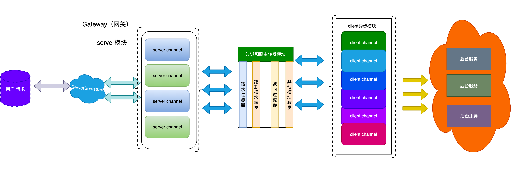

\#极客大学 Java 进阶训练营（三）：week2 学习笔记 周四


##gateway 作业

1 自定义handler ： SyncHttpOutboundHandler 用httpclient 实现调用接口

2 自定义过滤器：AccessLogFilter 打印header参数 在header 加上参数 nio:gzhold

3 自定义路由 RandomRouter

在LoadBalance 处理业务，实现路由规则

4 在server中，（HelloController类）获取header中自定义参数

##网关架构

网关大体模块结构如下图：



## 功能简介

    目前系统分为三个模块：server模块、route模块、client模块

- server模块：接收用户的请求，经过route模块解析后得到目标服务地址，client模块发送请求得到结果后，server返回给用户
- route模块：读取配置文件，加载路由配置，将不同的请求发送到不同的服务器
- client模块：异步请求客户端，返回请求结果给server模块
- Filter模块：对请求和返回进行处理，内置将请求方法都设置为POST，返回头中添加GATEWAY信息

    类似于NGINX，将用户请求根据配置转发到相应的后端服务程序中。目前还不支持restful json的请求。


##启动方式

运行主要类

```java
cn.qj.week3.gateway.server.NettyServerApp;
```

## 相关测试

    这里压测一下网关，基本命令如下，在2分钟左右基本能得到稳定值，不再大幅度抖动

```相关测试    这里压测一下网关，基本命令如下，在2分钟左右基本能得到稳定值，不再大幅度抖动sb -u http://localhost:80/greeting -c 20 -N 120
sb -u http://localhost:8808/test -c 20 -N 120
```

##工程结构

client：此模块负责将请求目标服务

server：负责接收用户请求

##代码思路大致如下


网关流程：用户发起请求，server端接收到请求，将请求转给client，client发送请求给内部服务，得到结果以后将结果返回给用户。代码编写中，server端和client端的结合难点。这里采用的是，在server端处理请求的时候，将当前channel传递到client handler中，这样client handle得到结果后，直接使用server channel返回结果即可。

