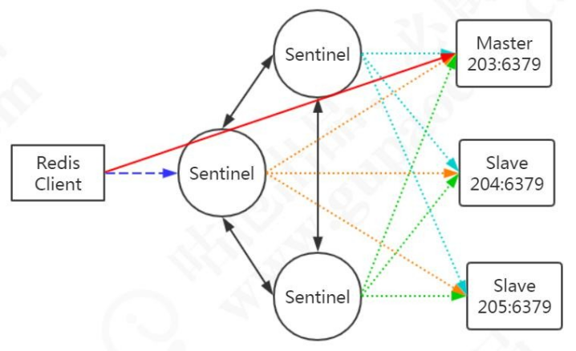
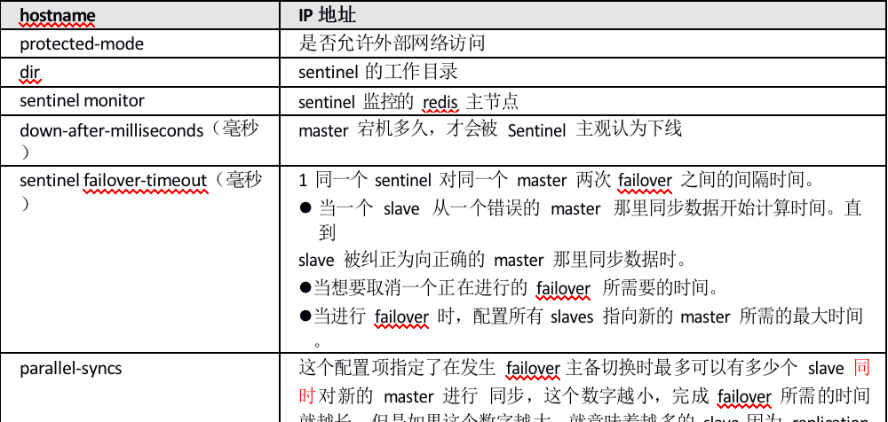
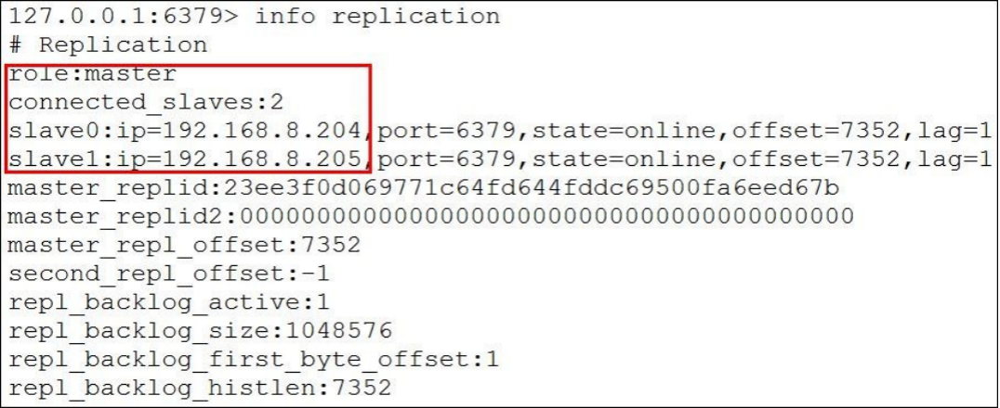
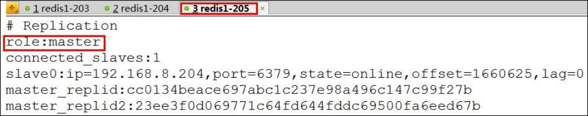
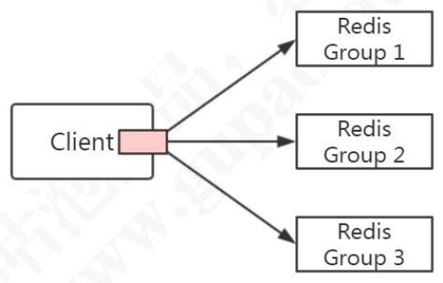

# Redis分布式实战总结

1、	Redis 主从复制的配置和原理

2、	Redis 哨兵机制（Sentinel）原理和实战

3、	redis 分布式的各种方案对比，包括客户端Sharding、代理Proxy 和Redis Cluster

 

# **1.** 为什么需要 Redis 集群 

## 为什么需要集群

### 性能

Redis 本身的 QPS 已经很高了，但是如果在一些并发量非常高的情况下，性能还是会受到影响。这个时候我们希望有更多的Redis 服务来完成工作。

### 扩展 

第二个是出于存储的考虑。因为 Redis 所有的数据都放在内存中，如果数据量大， 很容易受到硬件的限制。升级硬件收效和成本比太低，所以我们需要有一种横向扩展的方法。

### 可用性

第三个是可用性和安全的问题。如果只有一个 Redis 服务，一旦服务宕机，那么所有的客户端都无法访问，会对业务造成很大的影响。另一个，如果硬件发生故障，而单机的数据无法恢复的话，带来的影响也是灾难性的。

可用性、数据安全、性能都可以通过搭建多个 Reids 服务实现。其中有一个是主节点（master），可以有多个从节点(slave)。主从之间通过数据同步，存储完全相同的数据。如果主节点发生故障，则把某个从节点改成主节点，访问新的主节点。 

# **2.** Redis 主从复制 （replication） 

## 主从复制配置

例如一主多从,203 是主节点，在每个 slave 节点的redis.conf 配置文件增加一行

```
slaveof 192.168.8.203 6379
```

// 在主从切换的时候，这个配置会被重写成：

```
# Generated by CONFIG REWRITE 
replicaof 192.168.8.203 6379
```

或者在启动服务时通过参数指定master 节点：

```
./redis-server --slaveof 192.168.8.203 6379
```

或在客户端直接执行slaveof xx xx，使该Redis 实例成为从节点。启动后，查看集群状态：

```
redis> info replication
```

从节点不能写入数据（只读），只能从master 节点同步数据。get 成功，set 失败。

```
127.0.0.1:6379> set qianj 666

(error) READONLY You can't write against a read only replica.
```

主节点写入后，slave 会自动从master 同步数据。断开复制：

```
redis> slaveof no one 
```

此时从节点会变成自己的主节点，不再复制数据。

 

## 主从复制原理

### 连接阶段

1、slave node 启动时（执行 slaveof 命令），会在自己本地保存 master node 的信息，包括master node 的host 和ip。

2、slave node 内部有个定时任务replicationCron（源码replication.c），每隔 1 秒钟检查是否有新的 master node 要连接和复制，如果发现，就跟 master node 建立socket 网络连接，如果连接成功，从节点为该 socket 建立一个专门处理复制工作的文件事件处理器，负责后续的复制工作，如接收RDB 文件、接收命令传播等。

当从节点变成了主节点的一个客户端之后，会给主节点发送ping 请求。

### 数据同步阶段

3、master node 第一次执行全量复制，通过 bgsave 命令在本地生成一份RDB 快照，将 RDB 快照文件发给slave node（如果超时会重连，可以调大 repl-timeout 的值）。slave node 首先清除自己的旧数据，然后用RDB 文件加载数据。

问题：生成RDB 期间，master 接收到的命令怎么处理？

开始生成RDB 文件时，master 会把所有新的写命令缓存在内存中。在 slave node

保存了RDB 之后，再将新的写命令复制给 slave node。

### 命令传播阶段

4、master node 持续将写命令，异步复制给slave node

延迟是不可避免的，只能通过优化网络。

```
repl-disable-tcp-nodelay no
```

当设置为 yes 时，TCP 会对包进行合并从而减少带宽，但是发送的频率会降低，从节点数据延迟增加，一致性变差；具体发送频率与 Linux 内核的配置有关，默认配置为40ms。当设置为no 时，TCP 会立马将主节点的数据发送给从节点，带宽增加但延迟变小。

一般来说，只有当应用对 Redis 数据不一致的容忍度较高，且主从节点之间网络状况不好时，才会设置为yes；多数情况使用默认值no。

 

问题：如果从节点有一段时间断开了与主节点的连接是不是要重新全量复制一遍？ 如果可以增量复制，怎么知道上次复制到哪里？

通过master_repl_offset 记录的偏移量

```
redis> info replication
```


  

## 主从复制的不足

主从模式解决了数据备份和性能（通过读写分离）的问题，但是还是存在一些不足：

1、RDB 文件过大的情况下，同步非常耗时。

2、在一主一从或者一主多从的情况下，如果主服务器挂了，对外提供的服务就不可用了，单点问题没有得到解决。如果每次都是手动把之前的从服务器切换成主服务器， 这个比较费时费力，还会造成一定时间的服务不可用。

# **3.** 可用性保证之Sentinel 

## Sentinel原理

如何实现主从的自动切换？我们的思路：

创建一台监控服务器来监控所有Redis 服务节点的状态，比如，master 节点超过一定时间没有给监控服务器发送心跳报文，就把master 标记为下线，然后把某一个slave 变成master。应用每一次都是从这个监控服务器拿到master 的地址。

问题是：如果监控服务器本身出问题了怎么办？那我们就拿不到master 的地址了， 应用也没有办法访问。

那我们再创建一个监控服务器，来监控监控服务器……似乎陷入死循环了，这个问题怎么解决？这个问题先放着。

Redis 的Sentinel 就是这种思路：通过运行监控服务器来保证服务的可用性。

官网：

https://redis.io/topics/sentinel

从Redis2.8 版本起，提供了一个稳定版本的Sentinel（哨兵），用来解决高可用的问题。它是一个特殊状态的redis 实例。

我们会启动一个或者多个Sentinel 的服务（通过 src/redis-sentinel），它本质上只是一个运行在特殊模式之下的Redis，Sentinel 通过info 命令得到被监听Redis 机器的master，slave 等信息。



 

为了保证监控服务器的可用性，我们会对Sentinel 做集群的部署。Sentinel 既监控所有的Redis 服务，Sentinel 之间也相互监控。

注意：Sentinel 本身没有主从之分，只有Redis 服务节点有主从之分。概念梳理：master，slave（redis group），sentinel，sentinel 集合

### 服务下线

Sentinel 默认以每秒钟 1 次的频率向 Redis 服务节点发送 PING 命令。如果在down-after-milliseconds 内都没有收到有效回复，Sentinel 会将该服务器标记为下线

（主观下线）。

```
# sentinel.conf

sentinel down-after-milliseconds <master-name> <milliseconds> 
```

这个时候Sentinel 节点会继续询问其他的Sentinel 节点，确认这个节点是否下线， 如果多数Sentinel 节点都认为master 下线，master 才真正确认被下线（客观下线）， 这个时候就需要重新选举master。

### 故障转移

如果master 被标记为下线，就会开始故障转移流程。

既然有这么多的Sentinel 节点，由谁来做故障转移的事情呢？

故障转移流程的第一步就是在Sentinel 集群选择一个Leader，由Leader 完成故障转移流程。Sentinle 通过Raft 算法，实现Sentinel 选举。

#### Ratf算法 

在分布式存储系统中，通常通过维护多个副本来提高系统的可用性，那么多个节点之间必须要面对数据一致性的问题。Raft 的目的就是通过复制的方式，使所有节点达成一致，但是这么多节点，以哪个节点的数据为准呢？所以必须选出一个Leader。

大体上有两个步骤：领导选举，数据复制。

Raft 是一个共识算法（consensus algorithm）。比如比特币之类的加密货币，就需要共识算法。Spring Cloud 的注册中心解决方案Consul 也用到了Raft 协议。

Raft 的核心思想：先到先得，少数服从多数。Raft 算法演示：

http://thesecretlivesofdata.com/raft/

总结：

Sentinle 的Raft 算法和Raft 论文略有不同。

1、master 客观下线触发选举，而不是过了election timeout 时间开始选举。

2、Leader 并不会把自己成为 Leader 的消息发给其他 Sentinel。其他 Sentinel 等待 Leader 从 slave 选出 master 后，检测到新的 master 正常工作后，就会去掉客观下线的标识，从而不需要进入故障转移流程。

#### 故障转移

问题：怎么让一个原来的slave 节点成为主节点？

1、选出 Sentinel Leader 之后，由 Sentinel Leader 向某个节点发送 slaveof no one 命令，让它成为独立节点。

2、然后向其他节点发送 slaveof x.x.x.x xxxx（本机服务），让它们成为这个节点的子节点，故障转移完成。

问题：这么多从节点，选谁成为主节点？

关于从节点选举，一共有四个因素影响选举的结果，分别是断开连接时长、优先级排序、复制数量、进程id。

如果与哨兵连接断开的比较久，超过了某个阈值，就直接失去了选举权。如果拥有选举权，那就看谁的优先级高，这个在配置文件里可以设置（replica-priority 100）， 数值越小优先级越高。

如果优先级相同，就看谁从 master 中复制的数据最多（复制偏移量最大），选最多的那个，如果复制数量也相同，就选择进程id 最小的那个。

## Sentinel的功能总结

2. Monitoring. Sentinel constantly checks if your master and slave instances are working as expected.

3. Notification. Sentinel can notify the system administrator, another computer programs, via an API, that something is wrong with one of the monitored Redis instances.

4. Automatic failover. If a master is not working as expected, Sentinel can start a failover process where a slave is promoted to master, the other additional slaves are reconfigured to use the new master, and the applications using the Redis server informed about the new address to use when connecting.

5. Configuration provider. Sentinel acts as a source of authority for clients service discovery: clients connect to Sentinels in order to ask for the address of the current Redis master responsible for a given service. If a failover occurs, Sentinels will report the new address.

监控：Sentinel 会不断检查主服务器和从服务器是否正常运行。

通知：如果某一个被监控的实例出现问题，Sentinel 可以通过API 发出通知。

 

自动故障转移（failover）：如果主服务器发生故障，Sentinel 可以启动故障转移过程。把某台服务器升级为主服务器，并发出通知。

配置管理：客户端连接到Sentinel，获取当前的Redis 主服务器的地址。

 

## Sentinel实战

### Sentinel配置

为了保证 Sentinel 的高可用，Sentinel 也需要做集群部署，集群中至少需要三个Sentinel 实例（推荐奇数个，防止脑裂）。

以Redis 安装路径/usr/local/soft/redis-5.0.5/为例。在 204 和 205 的src/redis.conf 配置文件中添加

```
slaveof 192.168.8.203 6379
```

在 203、204、205 创建sentinel 配置文件（安装后根目录下默认有 sentinel.conf）：

```
cd /usr/local/soft/redis-5.0.5 
mkdir logs
mkdir rdbs
mkdir sentinel-tmp 
vim sentinel.conf
```

三台服务器内容相同：

```
daemonize yes 
port 26379 
protected-mode no
dir "/usr/local/soft/redis-5.0.5/sentinel-tmp"

sentinel monitor redis-master 192.168.8.203 6379 2 
sentinel down-after-milliseconds redis-master 30000 s
entinel failover-timeout redis-master 180000 s
entinel parallel-syncs redis-master 1 
```





上面出现了 4 个'redis-master'，这个名称要统一，并且使用客户端（比如 Jedis） 连接的时候名称要正确。

 

 

 

 

 

 

 

 

### Sentinel验证

启动Redis 服务和Sentinel

```
cd /usr/local/soft/redis-5.0.5/src 
# 启动Redis 节点

./redis-server ../redis.conf 
# 启动Sentinel 节点

./redis-sentinel ../sentinel.conf 
# 或者
./redis-server ../sentinel.conf --sentinel
```

查看集群状态：

```
 redis> info replication
```

203




204 和 205


 

模拟master 宕机，在 203 执行：

```
redis> shutdown
```

205 被选为新的Master，只有一个Slave 节点。



注意看sentinel.conf 里面的redis-master 被修改了！

模拟原master 恢复，在 203 启动 redis-server。它还是slave，但是 master 又有两个slave 了。

slave 宕机和恢复省略。

### Sentinel连接使用

Jedis 连接Sentinel（qj-jedis：JedisSentinelTest.java） master name 来自于sentinel.conf 的配置。


```java
private static JedisSentinelPool createJedisPool() { 
  String masterName = "redis-master"; 
  Set<String> sentinels = new HashSet<String>(); 
  sentinels.add("192.168.8.203:26379"); 
  sentinels.add("192.168.8.204:26379"); 
  sentinels.add("192.168.8.205:26379");

  pool = new JedisSentinelPool(masterName, sentinels); 
  return pool;

(/Users/qianjiang/tmp/JAVA-000/Week_12/Redis分布式.assets/wpsdGUPCt.png)咕泡出品，必属精品 [www.gupaoedu.com](http://www.gupaoedu.com/)
```

Spring Boot 连接Sentinel（springboot-redis：RedisAppTest.java

```yaml
spring.redis.sentinel.master=redis-master spring.redis.sentinel.nodes=192.168.8.203:26379,192.168.8.204:26379,192.168.8.205:26379 
```

无论是 Jedis 还是 Spring Boot（2.x 版本默认是 Lettuce），都只需要配置全部哨兵的地址，由哨兵返回当前的master 节点地址。

## 哨兵机制的不足

主从切换的过程中会丢失数据，因为只有一个master。只能单点写，没有解决水平扩容的问题。

如果数据量非常大，这个时候我们需要多个 master-slave 的group，把数据分布到不同的group 中。

问题来了，数据怎么分片？分片之后，怎么实现路由？

# **4.** Redis分布式方案

如果要实现Redis 数据的分片，我们有三种方案。第一种是在客户端实现相关的逻辑，例如用取模或者一致性哈希对key 进行分片，查询和修改都先判断key 的路由。

第二种是把做分片处理的逻辑抽取出来，运行一个独立的代理服务，客户端连接到这个代理服务，代理服务做请求的转发。

第三种就是基于服务端实现。

## 客户端Sharding




Jedis 客户端提供了 Redis Sharding 的方案，并且支持连接池。

### ShardedJedis

```java
:wqpublic class ShardingTest {

public static void main(String[] args) {

JedisPoolConfig poolConfig = new JedisPoolConfig();
// Redis 服务器
JedisShardInfo shardInfo1 = new JedisShardInfo("127.0.0.1", 6379); JedisShardInfo shardInfo2 = new JedisShardInfo("192.168.8.205", 6379);

// 连接池
List<JedisShardInfo> infoList = Arrays.asList(shardInfo1, shardInfo2); ShardedJedisPool jedisPool = new ShardedJedisPool(poolConfig, infoList);
 
ShardedJedis jedis = null; try{
jedis = jedisPool.getResource(); for(int i=0; i<100; i++){
jedis.set("k"+i, ""+i);
}

for(int i=0; i<100; i++){ 
  System.out.println(jedis.get("k"+i));
} 
}finally{
if(jedis!=null) { 
  jedis.close();
}
}
}
}
```

 

待整理。。。。


 


