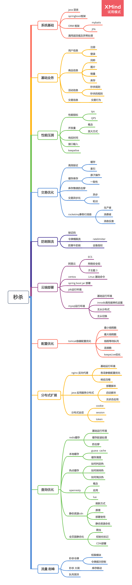
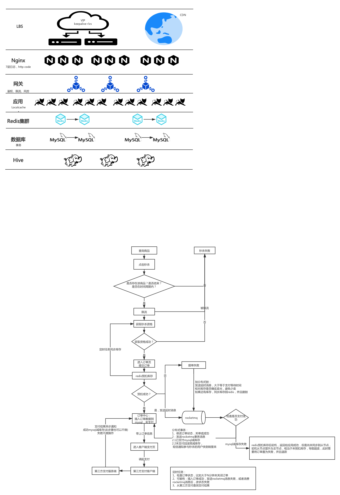

Week15 作业题目：

周四作业：
1.（选做）针对课上讲解的内容，自己动手设计一个高并发的秒杀系统，讲架构图， 设计文档等，提交到 GitHub。

2.（选做）针对自己工作的系统，或者自己思考的复杂场景，做系统性的架构设计。

周六作业：
1.（选做）学习《重构–改善既有代码的设计》这本书，写读书笔记。
2.（选做）对于目前自己维护的项目代码，思考如何改善设计和实现。

以上作业，要求 1 道必做题目提交到 GitHub 上面，Week15 作业提交地址：
https://github.com/JAVA-000/JAVA-000/issues/148
请务必按照示例格式进行提交，不要复制其他同学的格式，以免格式错误无法抓取作业。
作业提交截止时间 1 月 27 日（周三）23:59 前。

作业参考示例地址，由秦老师和助教共建，每周同步更新： https://github.com/JavaCourse00/JavaCourseCodes

Github 使用教程： https://u.geekbang.org/lesson/51?article=294701

学号查询方式：PC 端登录 time.geekbang.org, 点击右上角头像进入我的教室，左侧头像下方 G 开头的为学号

# 秒杀系统的架构

先附上 秒杀要做一些功能点：

来张思维导图：

##  秒杀主架构和流程图

结合本案例，请思考以下问题：

## 1、如何设计秒杀系统？
秒杀系统的业务特征：高并发、高性能、高可用
       架构思维:分层、高可用、高并发、高性能、可伸缩

> 问题复杂---》化复杂为简单---》架构分层、发散思考高并发业务场景--》秒杀系统要支持高流量--》扩容--》伸缩性
>
> 网络：增加网络带宽
>
> 硬件：扩容
>
> 软件系统:分布式、满足可伸缩性。
>
> 可伸缩:和硬件有关，加机器，软件不改变区别，
>
> 可扩展：和软件有关，通用性设计，满足通用的业务场景 
>
> 例如：一套代码，满足类似的业务功能，可维护性非常好，基本不做任何改动

负载均衡:硬负载、软负载

动静分离:页面--》CDN ，应用--》tomcat容器

读写分离：读应用，写应用，读库，写库

流量: 流量逐步过滤--MQ削峰、一定规则算法过滤流量、服务限流
       流量过滤规则:先到、VIP用户、非法的访问流量、安全有关、防黄牛等等。例如：100个商品，进来的10w用户流量，逐步的过滤。

 页面---》用户判断，有状态--》秒杀--》MQ--》下单服务---》数据库10w人---》1000人(全局计数器)，其他用户设为秒杀失效的状态----》1000人筛选，有相关的规则:流量过滤规则.--->500人--》100人

## 2、如何提高生产消息的效率？
1000w---》批量生产--》多线程、线程池批量生产数据

## 3、如何提高消息发送的效率？
1000w--》逐条发送--》网络耗时大(网络通信)，串行发送耗时长(java应用)
       1000w--》批量发送--》网络耗时减少(网络通信)、并行发送耗时短(java应用)
例如:1000w--》批量发，每个批次发1w

## 4、本案例，如何具体实现批量处理？
消息生产方批量产生数据、批量发送数据，并发量、性能都满足消息消费方，批量消费消息。

思考
       1、分析Kafka、RocketMQ架构图，MQ通用架构一般包括哪几个核心组件？
       生产者、消费者、broker集群、注册中心

2、从架构角度考虑，MQ有什么优缺点？使用方面，有哪些坑？
		优点：broker集群存储消息--》支持高并发、削峰、异步、解耦等
		缺点：引入MQ，架构变的复杂，有一定的开发成本、维护成本。很多时候，不一定需要MQ，需要具体问题具体分析。

> 注意的坑：幂等性的判断、分布式id，消费方容易出错，幂等性判断容易出问题，导致所谓的"丢消息"。
> 例如：消费者消费消息产生异常，但是没有对异常进行处理，返回处理成功的状态，没有告警、消息没有重发，导致所谓的"丢消息"。

## 几个问题及思考？
1、一般而言，MQ幂等性，有哪两种常见的实现方式?
提示：纯技术、业务唯一性
纯技术：分布式id生成算法 雪花
业务唯一性:业务主键
幂等性:写之前，要判断数据的唯一性。
例如:由于网络抖动等原因，MQ有可能会重发数据，
所以，需要有幂等性判断。

2、MQ生产方具体需要做什么？
MQ生产方，设置唯一性ID，例如：分布式id。 参考雪花算法、业务区分方法。

## 实战思路讲解
1、分析MQ生产方秒杀千万QPS的特点
参考前面的内容：高并发、高性能

2、高并发：如何快速发送千万数据？
批量处理、多线程、线程池，提高生成数据的效率、发送效率

3、高性能：对于千万级数据，如何减少网络开销？
批量处理，减少网络传输的时间、减少java应用发送的时间

4、生产方如何保证消息的幂等性？
生成唯一性分布式id。参考第11个案例

5、生产方如何实现消息的并发计数？
单机版:原子操作类
分布式:redis、zk

## 实战详细步骤演示
快速落地基本的MQ生产、消费功能
结合多线程、线程池、批量处理、原子操作类、分布式id等方面的内容开发
压测、看日志、优化性能

核心代码：
BasicProducer:基本的MQ生产者
BasicConsumer:基本的MQ消费者
BatchProducer：批量的MQ生产者
SingleProducer：单条的MQ生产者
DistrIdGenerator2：分布式id生成类
TestBatchProducer:并发测试类

生成随机ID入口方法
规则：年月日时分秒毫秒（去掉前两位）+服务器IP（第四位，长度为三位，若不足三位，则在前面补0）+4位递增序列数（1—9999，若不足4位，后面补0）
特征：共22位，满足分布式，线程安全，不会重复
	 
	 
	 
## kafka头脑风暴
1、Kafka是如何提高并发性的，消息存储在哪里？
消息存储在broker集群

2、Kafka和多线程的生产消费者设计模式的空间换时间分别体现在哪里？
kafka：broker集群，空间换时间
多线程：并发数据结构(机器内存)，空间换时间

## 秒杀基于 redis cache的小栗子：

##最后 

 附上架构训练营的 秒杀笔记 https://xie.infoq.cn/article/936d81a5e4193c011ffeec6f3

总结有点重复 ，方便以后查询吧！！！